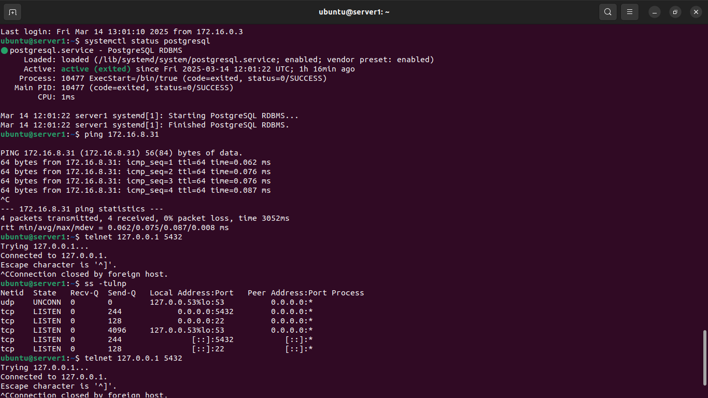
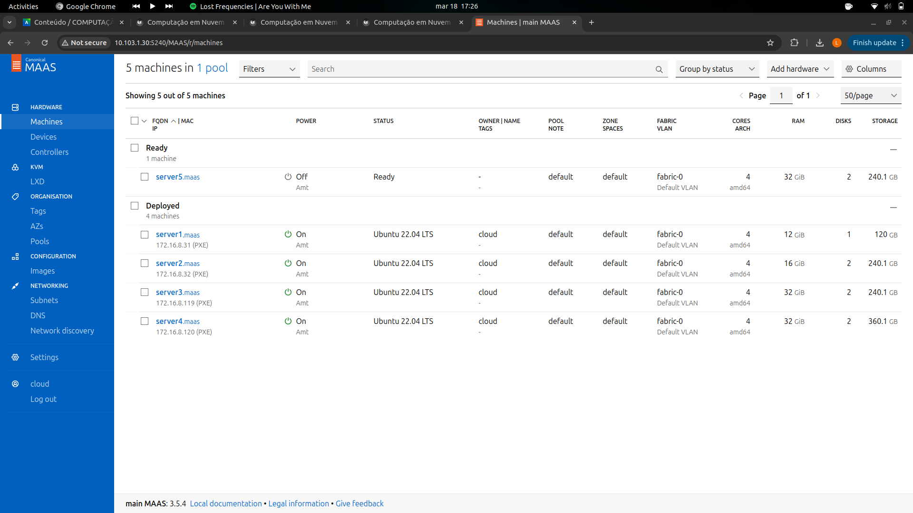
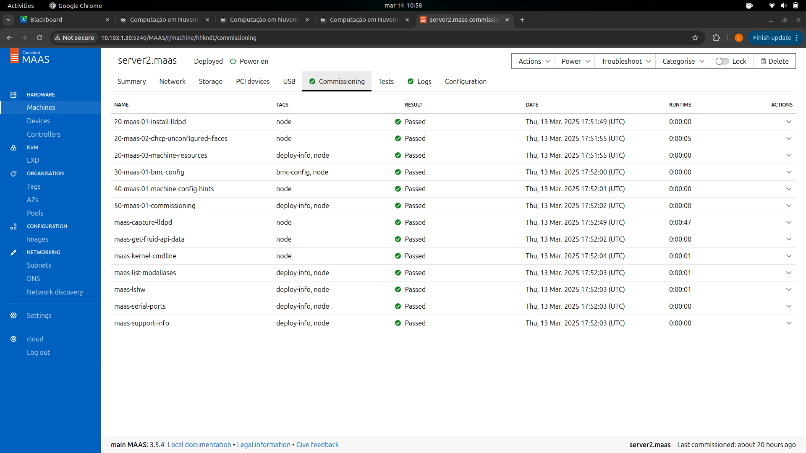
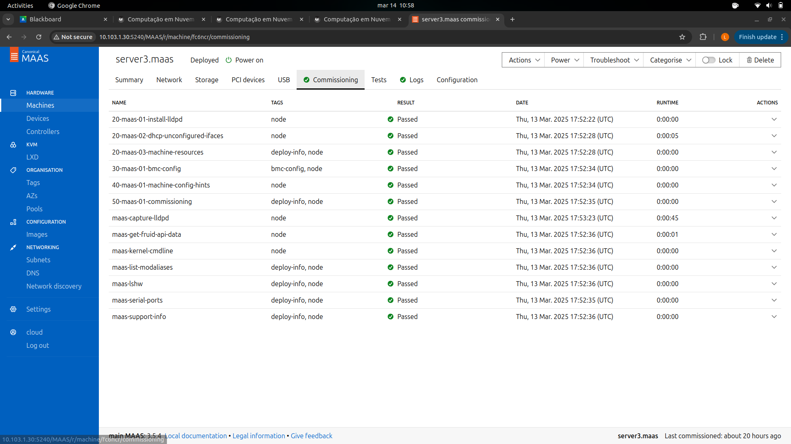
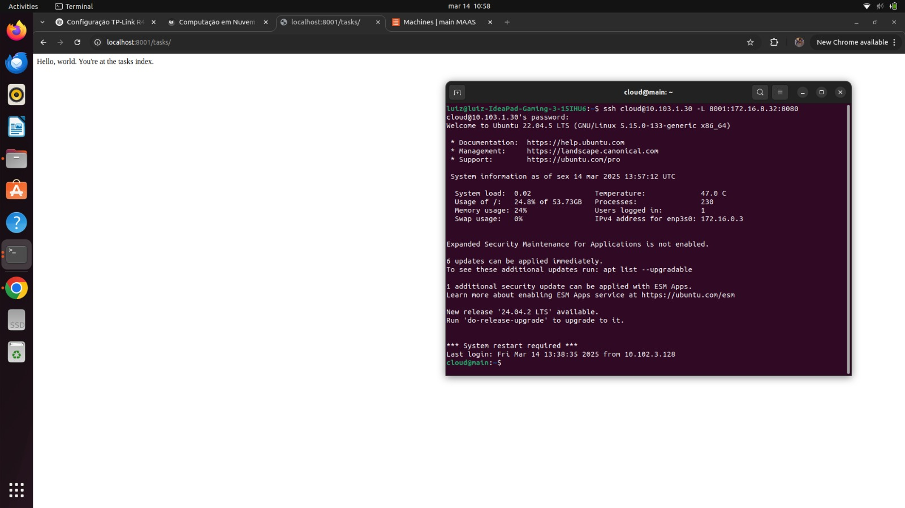
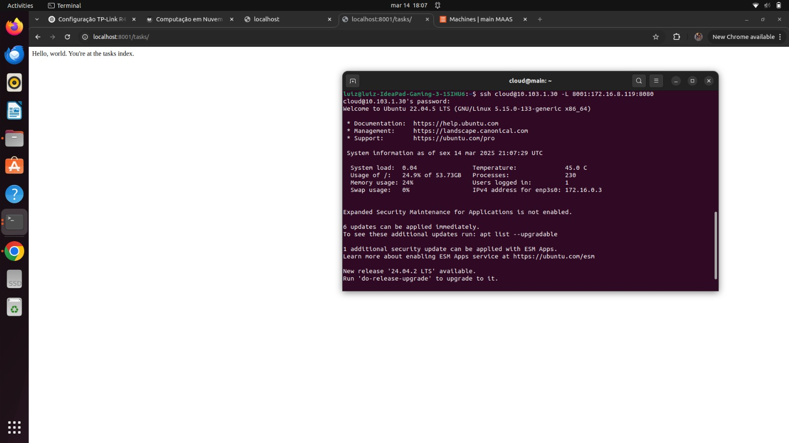
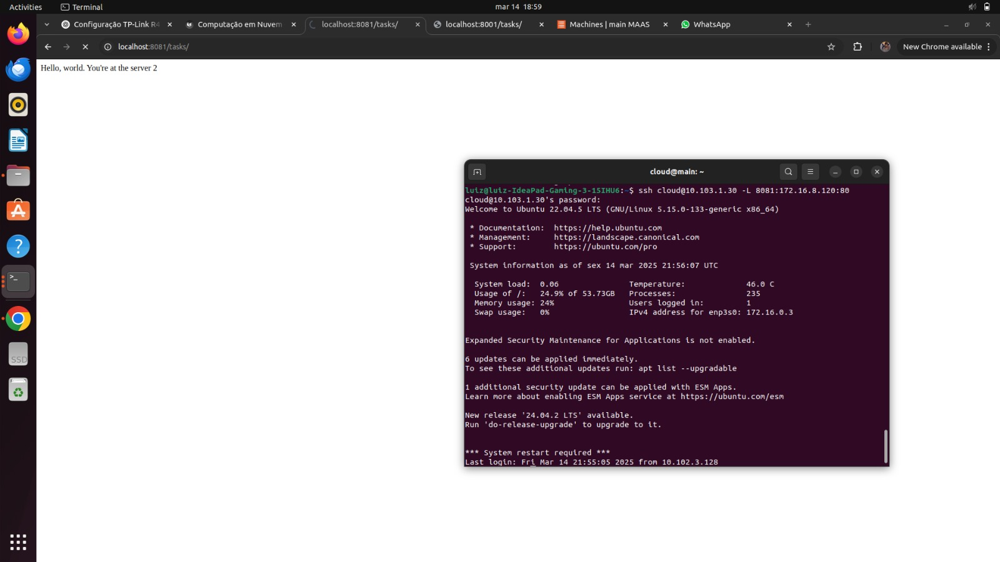
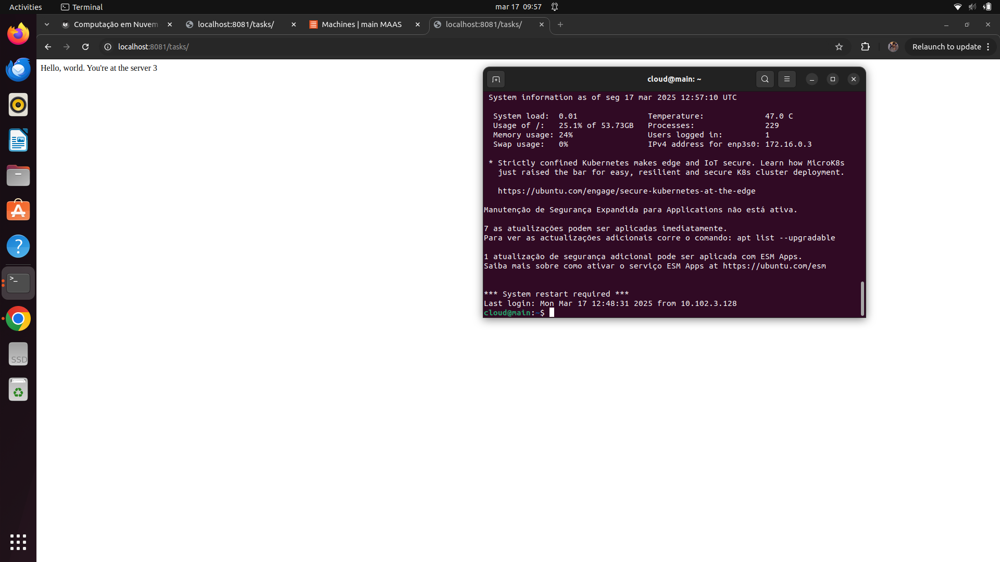

## Objetivo

O objetivo desse projeto é transformar servidores físicos em recursos gerenciáveis online, de forma semelhante a uma infraestrutura de nuvem, tornando a administração da rede de hardwares mais eficiente, prática e escalável.

## Montagem do Roteiro

Os pontos "tarefas" são os passos que devem ser seguidos para a realização do roteiro. Eles devem ser claros e objetivos. Com evidências claras de que foram realizados.

## Infra

### Tarefa 1

Instalando o MAAS:

<!-- termynal -->

``` bash
sudo snap install maas --channel=3.5/Stable
```

 
/// caption
Dashboard do MAAS
///

Conforme ilustrado acima, a tela inicial do MAAS apresenta um dashboard com informações sobre o estado atual dos servidores gerenciados. O dashboard é composto por diversos painéis, cada um exibindo informações sobre um aspecto específico do ambiente gerenciado. Os painéis podem ser configurados e personalizados de acordo com as necessidades do usuário.

### Tarefa 2

Acessando a máquina remotamente:

<!-- termynal -->

``` bash
ssh cloud@172.16.0.3
```

Configurando o MaaS:

<!-- termynal -->

``` bash
sudo maas init region+rack --maas-url http://172.16.0.3:5240/MAAS --database-uri maas-test-db:///

sudo maas createadmin
```

Depois disso foi realizado um NAT para permitir o acesso externo "Rede Wi-fi Insper" do computador ao servidor MAIN.


## App


### Tarefa 1

Funcionando e seu Status está como "Ativo" para o Sistema Operacional:

<!-- termynal -->

``` bash
systemctl status postgresql
```

Acessivel na própria maquina na qual ele foi implantado:

<!-- termynal -->

``` bash
telnet 127.0.0.1 5432
``` 

Acessivel a partir de uma conexão vinda da máquina MAIN:

<!-- termynal -->

``` bash
ping 172.16.8.31
``` 

Em qual porta este serviço está funcionando:

<!-- termynal -->

``` bash
ss -tulnp
telnet 127.0.0.1 5432
``` 


/// caption
Comandos no terminal
///

A imagem do terminal acima mostra a verificação do PostgreSQL rodando no server1. O comando systemctl status postgresql confirma que o serviço está ativo no sistema operacional. O teste de conexão local (telnet 127.0.0.1 5432) indica que o serviço está acessível na própria máquina. A conectividade externa foi validada com ping 172.16.8.31, garantindo que o servidor pode se comunicar com a máquina MAIN. Por fim, o comando ss -tulnp confirma que o PostgreSQL está rodando na porta 5432, tornando-o acessível para conexões.


### Tarefa 2

Do Dashboard do MAAS com as máquinas:


/// caption
Dashboard do MAAS
///

Da aba images, com as imagens sincronizadas:

 
/// caption
Comission server1
///

As imagens a seguir mostram a Aba de cada maquina mostrando os testes de hardware e commissioning com Status "OK":

 
/// caption
Comission server1
///

 
/// caption
Comission server2
///

 
/// caption
Comission server3
///

 
/// caption
Comission server4
///

 
/// caption
Comission server5
///

### Tarefa 3

Tela do Dashboard do MAAS com o server1 e server2 e seus respectivos IPs:


/// caption
Dashboard do MAAS
///

Aplicação Django, provando que está conectado ao server2 apartir do seu ip para realizar a ponte:


/// caption
Django conectado ao server
///

Para a implementacao manual da aplicacao Django e banco de dados foi necessário subir uma aplicação ORM Django pré produzida e realizado todos os comandos direto no cli do terminal:

<!-- termynal -->

``` bash
maas cloud machines allocate name=server2
```

Após solicitar a reserva da máquina e realizar deploy do server2 via cli, foi clonado o repositório dentro do SSH do server2 e instalado sh e testado acessando o serviço na porta 8080 no terminal do maas:

<!-- termynal -->

``` bash
wget http://172.16.8.32:8080/admin/
``` 

### Tarefa 4

Print da tela do Dashboard do MAAS com o server1, server2 e server3 e seus respectivos IPs:


/// caption
Dashboard do MAAS
///

Print da aplicacao Django, provando que está conectado ao server2 apartir do seu ip via ssh:


/// caption
Django server 2
///

Print da aplicacao Django, provando que está conectado ao server3 apartir do seu ip via ssh:


/// caption
Django server 3
///

Diferente do caso na tarefa 2, na qual o Django foi instalado manualmente, desta vez foi utilizado o Ansible para instalar o framework que é um processo mais rápido e prático, o Ansible já instala o Django automaticamente e, além disso, é escalável, ou seja, é possível instalar em vários servidores de uma só vez, o que é extremamente útil em grandes datacenters. Por outro lado, o processo manual é mais detalhado e tem um controle maior sobre o que está sendo feito, já que é realizado passo a passo no teminal.

### Tarefa 5

Print da tela do Dashboard do MAAS com o server1, server2, server3 e server4 Maquinas e seus respectivos IPs:


/// caption
Dashboard do MAAS
///

Após modificar os arquivos views.py para distinguir cada um dos servidores, o Nginx foi utilizado para aplicar o load balancing, distribuindo o tráfico entre os servidores. O Ngninx recebe a requisição e estabelece para qual servidor enviar.

Prints das respostas de cada request, provando que está conectado ao server 4, batendo no server2 e server3 respectivamente:


/// caption
Resposta Django 2
///


/// caption
Resposta Django 3
///

Note que, as pontes foram realizadas com portas diferentes das utilizadas na tarefa 4

## Discussões

Uma dificuldade foi começar de fato, mas depois que foi entendido a maneira que as tarefas são cobradas e como é preciso pesquisar e discutir em dupla, a atividade começou a fluir. Vale ressaltar que a fabricação do cabo de rede acabou dando uma dor de cabeça desnecessária, foi preciso ser refeito mais de uma vez e acabou atrasando o projeto no início. Uma parte fácil foi trabalhar no dashboard do MaaS, é uma plataforma intuitiva e prática de mexer.

## Conclusão

O objetivo do projeto foi alcançado ao transformar servidores físicos em recursos gerenciáveis online. A implementação do MaaS permitiu gerenciar os servidores, enquanto o uso do NGINX como proxy reverso garantiu o balanceamento de carga adequado entre eles. A aplicação Django foi configurada e conectada aos servidores, utilizando tanto instalação manual quanto com Ansible, provando a escalabilidade do processo. 