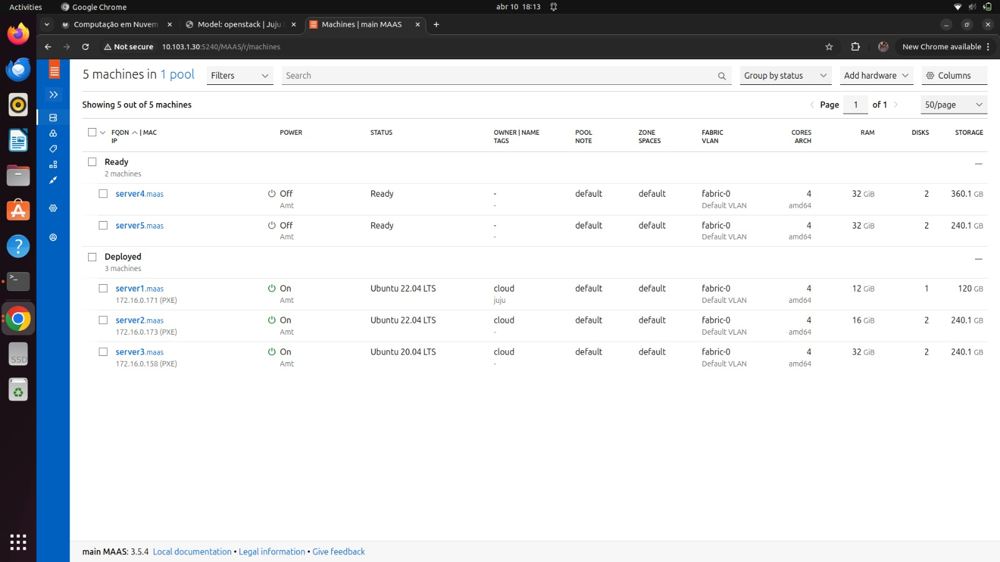
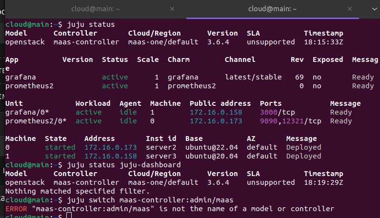
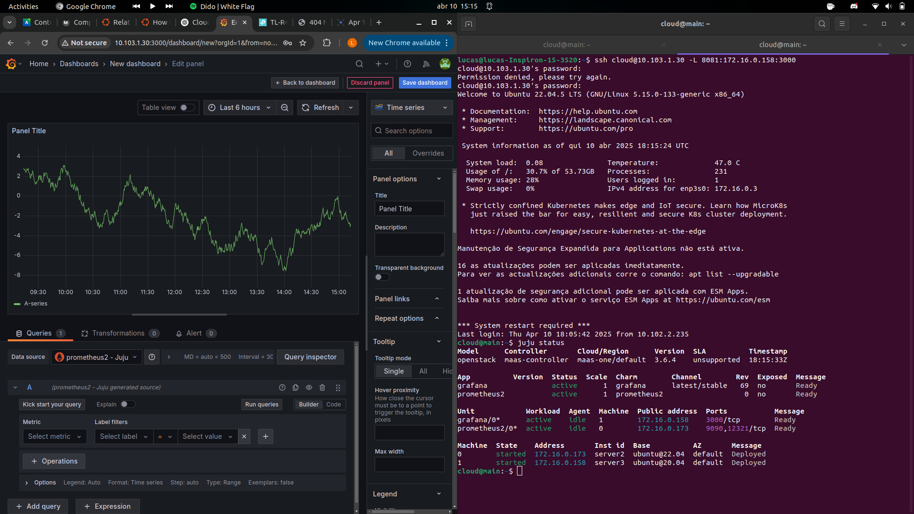
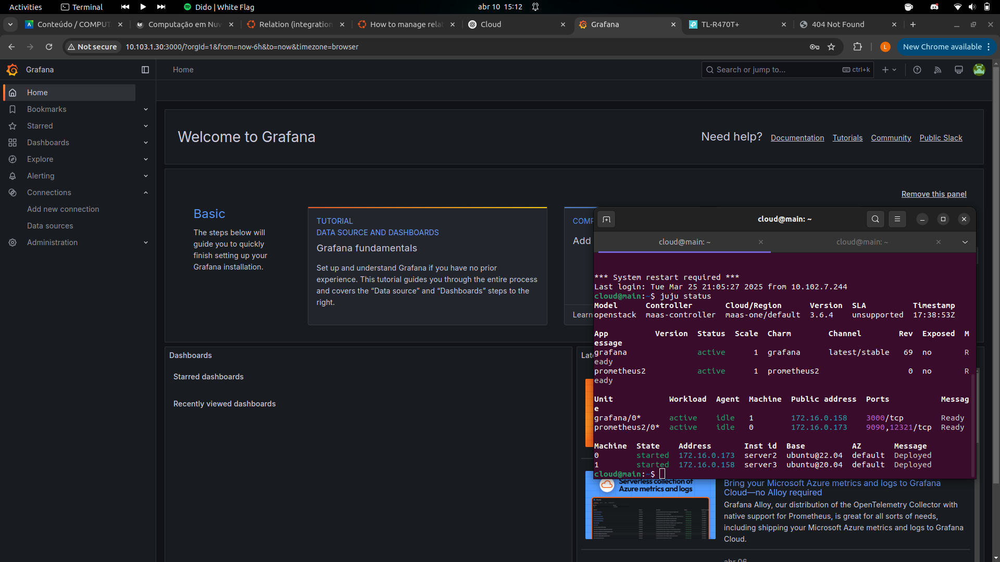
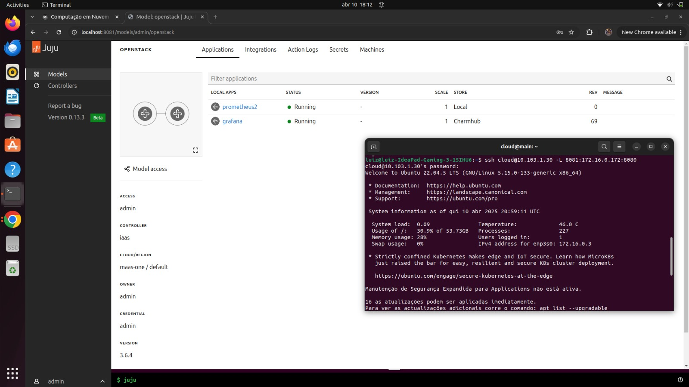

## Objetivo

O objetivo desse projeto é implementar, na rede de servidores, a ferramenta de visualização e monitoramento de dados: Grafana, com o banco Prometheus.

## Montagem do Roteiro

Os pontos "tarefas" são os passos que devem ser seguidos para a realização do roteiro. Eles devem ser claros e objetivos. Com evidências claras de que foram realizados.

## Infra

Foi realizado o provisionamento de infraestrutura utilizando o Juju como orquestrador de deploy integrado ao MAAS, permitindo o gerenciamento dinâmico de servidores bare-metal.

## App

### Tarefa 1

Tela do Dashboard do MAAS com as máquinas seus respectivos IPs:

 
/// caption
Dashboard do MAAS
///

### Tarefa 2

Foi criado uma pasta "charms" para baixar o Grafana e o Prometheus, feito o deploy de ambos e sua integração. A figura mostra a tela do terminal com o Grafana como active:

 
/// caption
Terminal Grafana-active
///

### Tarefa 3

Foi criado um dashboard dentro do Grafana e adicionado o Prometheus como source:

 
/// caption
Grafana com Prometheus como Source
///

### Tarefa 4

Para acessar o Dashboard do Grafana pela rede do Insper, foi necessário fazer um túnel:

 
/// caption
Tela Dashboard Grafana pela Rede do Insper
///

### Tarefa 5

Por fim, foi utilizado túnel para ascessar o dashboard do Juju. A tela a seguir mostra aplicações sendo gerenciadas pelo Juju:

 
/// caption
Tela aplicações gerenciadas pelo Juju
///

## Discussões

Uma dificuldade foi compreender como funcionava o sistema de containers que foi utlizado para a instalação dos softwares. Essa mudança do controlador, utilizando o comando juju-switch, ficou um pouco confuso no começo. O roteiro foi curto, não havia comandos de terminal muito complexos, oque facilitou sua realização.

## Conclusão

O objetivo foi alcançado, o Grafana foi integrado ao Prometheus para monitoramento na rede de servidores. As ferramentas foram instaladas e configuradas com auxílio do Juju e MAAS, com acesso remoto garantido por meio de túneis de rede. 