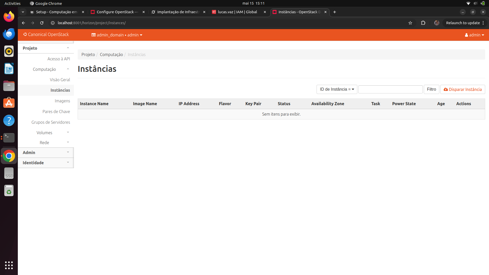

## Objetivo

O objetivo desse projeto é configurar e utilizar uma nuvem privada OpenStack, explorando redes virtuais SDN e automação com Juju e Terraform. Dividido em criação, configuração e uso da infraestrutura, o roteiro foca em implantar aplicações em VMs e gerenciar recursos como código. O objetivo é compreender a arquitetura e operação de nuvens privadas

## Montagem do Roteiro

Os pontos "tarefas" são os passos que devem ser seguidos para a realização do roteiro. Eles devem ser claros e objetivos. Com evidências claras de que foram realizados.

## Infra

Realizamos a instalação de todas as dependências do Openstack, verificando a implantação de cada uma delas através do comando juju status

## Setup

### Tarefa 1

Primeiro, serão mostradas cada aba do dashboard do OpenStack antes de realizar a configuração

Terminal com todas as aplicações instaladas:

<!-- termynal -->

``` bash
juju status
```


/// caption
Juju status
///

Dashboard do MAAS com as máquinas:


/// caption
Tela do Dashboard do MAAS
///

Aba compute overview no OpenStack Dashboard:


/// caption
Compute overview
///

Aba compute instances no OpenStack Dashboard:


/// caption
Compute instances
///

Aba network topology no OpenStack Dashboard:


/// caption
Net topology
///

Após isso realizamos a configuração do OpenStack, definindo a rede interna, externa, conexão e criação das instâmcias


### Tarefa 2

Dashboard do MAAS com as máquinas:


/// caption
Tela do Dashboard do MAAS
///

Aba compute overview no OpenStack Dashboard:


/// caption
Compute overview
///

Aba compute instances no OpenStack Dashboard:


/// caption
Compute instances
///

Aba network topology no OpenStack Dashboard:


/// caption
Net topology
///

Após feita a configuração, é possível notar a criação de uma instância jammy-1, cada instância é criada da seguinte maneira:

Uma imagem de boot foi importada para o Glance para ser utilizada na criação de instâncias de servidor.

<!-- termynal -->

``` bash
mkdir ~/cloud-images

wget http://cloud-images.ubuntu.com/jammy/current/jammy-server-cloudimg-amd64.img \
   -O ~/cloud-images/jammy-amd64.img
```

Importar a imagem para o Glance com o nome escolhido (jammy-amd64 no exemplo).

<!-- termynal -->

``` bash
mkdir ~/cloud-images

wget http://cloud-images.ubuntu.com/jammy/current/jammy-server-cloudimg-amd64.img \
   -O ~/cloud-images/jammy-amd64.img
```

Criação de uma flavor para definir o perfil de hardware das novas instâncias. O flavor m1.small foi configurado com os seguintes recursos.

<!-- termynal -->

``` bash
openstack flavor create --ram 2048 --disk 20 --ephemeral 20 m1.small
```

Além disso, configuramos a rede externa para permitir a conectividade, para isso:

Foi criada a rede externa ext_net.

<!-- termynal -->

``` bash
openstack network create --external --share \
   --provider-network-type flat --provider-physical-network physnet1 \
   ext_net
```

Uma sub-rede, chamada ext_subnet, foi criada para a rede ext_net, utilizando os valores baseados no ambiente local.

<!-- termynal -->

``` bash
openstack subnet create --network ext_net --no-dhcp \
   --gateway 172.16.7.1 --subnet-range 172.16.7.0/23 \
   --allocation-pool start=172.16.7.0,end=172.16.8.255 \
   ext_subnet
```

Por fim configuramos a rede interna:

Uma rede interna privada, chamada user1_net, foi criada para uso específico do projeto, junto com uma sub-rede chamada user1_subnet.

<!-- termynal -->

``` bash
openstack network create --internal user1_net

openstack subnet create --network user1_net \
   --subnet-range 192.169.0.0/24 \
   --allocation-pool start=192.169.0.10,end=192.169.0.99 \
   user1_subnet
```

Um roteador chamado user1_router foi criado, associado à sub-rede user1_subnet e configurado para usar a rede pública externa ext_net como gateway.

<!-- termynal -->

``` bash
openstack router create user1_router
openstack router add subnet user1_router user1_subnet
openstack router set user1_router --external-gateway ext_net
```


### Tarefa 3

Representação da arquitetura de rede:

 
/// caption
Diagrama Rede
///

## App


### Tarefa 4

Foi realizada a configuração das aplicações em máquinas virtuais (VMs) no OpenStack, seguindo a topologia especificada, com 2 instâncias da API, 1 instância de banco de dados e 1 instância de Load Balancer (Nginx). O foco foi otimizar os flavors para desempenho razoável e baixo custo

Representação da topologia

 
/// caption
Diagrama Topologia
///

Lista de VMs utilizadas com nome e IPs alocados:

 
/// caption
Lista de VMs
///

Print do Dashboard do FastAPI conectado via máquina Nginx/LB:

 
/// caption
Dashboard do FastAPI conectado via máquina Nginx/LB
///

Os prints a seguir demonstram em qual server (máquina fisica) cada instância foi alocado pelo OpenStack:

 
/// caption
API1
///

 
/// caption
API2
///

 
/// caption
Database
///

 
/// caption
Nginx
///

## Conclusão

O objetivo do projeto foi alcançado ao criar a gestão de uma nuvem privada OpenStack, desde a configuração inicial da infraestrutura com MAAS, Juju e Ceph, até a implantação de aplicações e automação com Terraform.Foram configuradas redes públicas e internas, instâncias para Load Balancer, API e banco de dados. A infraestrutura atendeu aos requisitos de custo e desempenho, preparando-nos para gerenciar ambientes como esse.