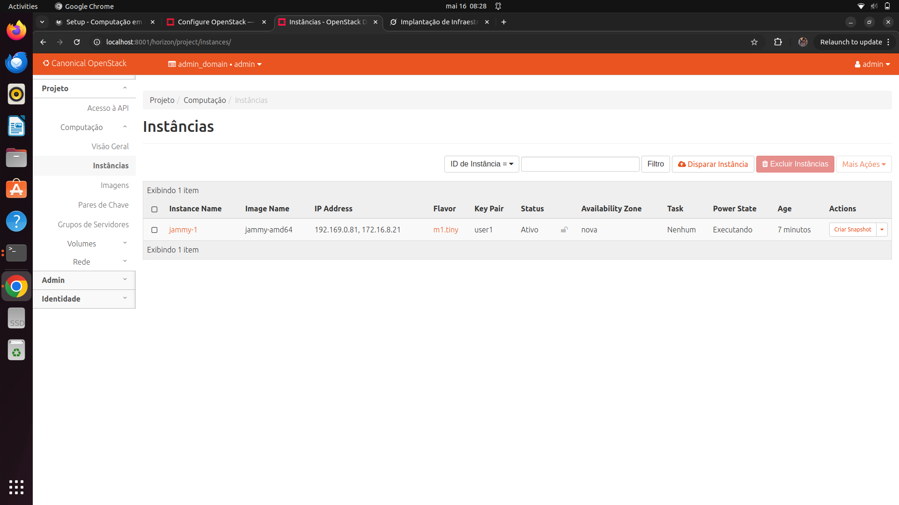

## Objetivo

O objetivo desse projeto é aplicar os princípios de Infraestrutura como Código (IaC) com o Terraform, incluindo a definição de recursos e o gerenciamento de ciclo de vida da infraestrutura de forma repetível e idempotente. Além disso, introduzir os conceitos de SLA (acordos de nível de serviço) e DR (recuperação de desastres), destacando sua importância para sistemas críticos, e explorar a estrutura de gestão de identidades e acesso no OpenStack (Keystone)

## Montagem do Roteiro

Os pontos "tarefas" são os passos que devem ser seguidos para a realização do roteiro. Eles devem ser claros e objetivos. Com evidências claras de que foram realizados.

## Infra

Na seção de criação da hierarquia de projetos, foi estabelecida uma separação lógica de recursos no OpenStack via Horizon Dashboard para evitar conflitos entre usuários. Inicialmente, criou-se o domínio AlunosDomain (Identity > Domains > Create Domain). Em seguida, foram criados dois projetos, KitOLuiz e KitOLevi, associados ao domínio (Identity > Projects > Create Project). Dois usuários, Luiz e Levi, foram adicionados (Identity > Users > Create User), vinculados aos respectivos projetos com papéis administrativos, garantindo uma gestão isolada e eficiente.

## App

Para a criação da infraestrutura com IaC, foi utilizada a ferramenta Terraform para definir e provisionar recursos no OpenStack de forma automatizada. Criou-se uma estrutura de pastas no servidor MAIN, com arquivos de configuração para o provedor OpenStack, duas instâncias (instance1 e instance2), uma rede interna (network_1) com sub-rede, e um roteador conectado à rede externa. As credenciais do usuário foram configuradas via arquivo openrc, garantindo autenticação e consistência na implantação dos recursos.

### Tarefa 1

Abas Identy projects no OpenStack:

/// caption
Identity projects
///

Aba Identy users no OpenStack:

/// caption
Identity users
///

Abas compute overview no OpenStack:

/// caption
Identity users
///

/// caption
Identity users
///

Abas compute instances no OpenStack:

/// caption
Compute instances
///

/// caption
Compute instances
///

Abas network topology no OpenStack:

/// caption
Network topology
///

/// caption
Network topology
///

## Conclusão

O objetivo do projeto foi alcançado ao criar a gestão de uma nuvem privada OpenStack, desde a configuração inicial da infraestrutura com MAAS, Juju e Ceph, até a implantação de aplicações e automação com Terraform. Foram configuradas redes públicas e internas, instâncias para Load Balancer, API e banco de dados, além de uma hierarquia de projetos e usuários no OpenStack. A infraestrutura atendeu aos requisitos de custo e desempenho.

## Criando um plano de Disaster Recovery e SLA

Com base o que foi concluído com esse projeto, os pontos a seguir foram pensados considerando o cargo de CTO (Chief Technology Officer) de uma grande empresa com sede em várias capitais no Brasil e precisa implantar um sistema crítico, de baixo custo e com dados sigilosos para a área operacional.

### Public ou Private?

Pelo o que foi aprendido nesse roteiro, seria mais sensato implementar um sistema de Private Cloud, principalmente porque a empresa estará trabalhando com dados sigilosos para a área operacional. Apesar de ter custos iniciais mais altos, Privates Cloud, como o OpenStack, elimina o risco de exposição de dados sensíveis em ambientes multitenant (como na nuvem pública) e permite uma arquitetura sob medida para as necessidades operacionais da empresa.

### Time de DevOps

Para garantir a estabilidade, escalabilidade e segurança do novo sistema crítico da área operacional, seria essencial a formação de um time de DevOps. A função desse time seria atuar com os desenvolvedores e com a equipe de infraestrutura, com o objetivo de automatizar os processos de desenvolvimento e manutenção, afim de diminuir erros por falha humana e sistematizar o esquema de modo que as tarefas sejam realizado sempre da mesma maneira.

### Plano de DR (Disaster Recovery) e HA (Alta Disponibilidade)

Mapeamento das Principais Ameaças:

Falha de Hardware: Quebra de servidores ou storage, causando indisponibilidade.
Ataques Cibernéticos: Ransomware ou DDoS, comprometendo dados sigilosos.
Erros Humanos: Configurações incorretas ou exclusões acidentais.
Desastres Naturais: Inundações ou apagões em sedes.
Falhas de Rede: Interrupções no tráfego entre sedes.

Ações Priorizadas para Recuperação:

Imediato (0-1 hora): Ativar alertas via monitoramento, isolar sistemas afetados e restaurar snapshots de backup.
Curto Prazo (1-4 horas): Reconfigurar redes e recriar instâncias automaticamente.
Médio Prazo (4-24 horas): Restaurar bancos de dados e validar aplicações com testes.

Política de Backup:

Frequência: Backups diários incrementais e semanais completos.
Armazenamento: Replicação em storage separado e outra sede.
Retenção: 7 dias diários e 4 semanas semanais.
Testes: Restauração semanal para garantir integridade.

Implementação de Alta Disponibilidade (HA):

Redundância: Manter múltiplos nós de computação e armazenamento.
Balanceamento: Usar Load Balancers para distribuir requisições.
Replicação: Configurar replicação síncrona de dados em bancos e storage.
Monitoramento: Implantar ferramentas como Prometheus para alertas em tempo real.
Failover: Automatizar a troca para nós reserva em caso de falha.

Essa estratégia assegura um ambiente robusto, resiliente e preparado para mitigar interrupções, alinhado às necessidades operacionais críticas da empresa.
